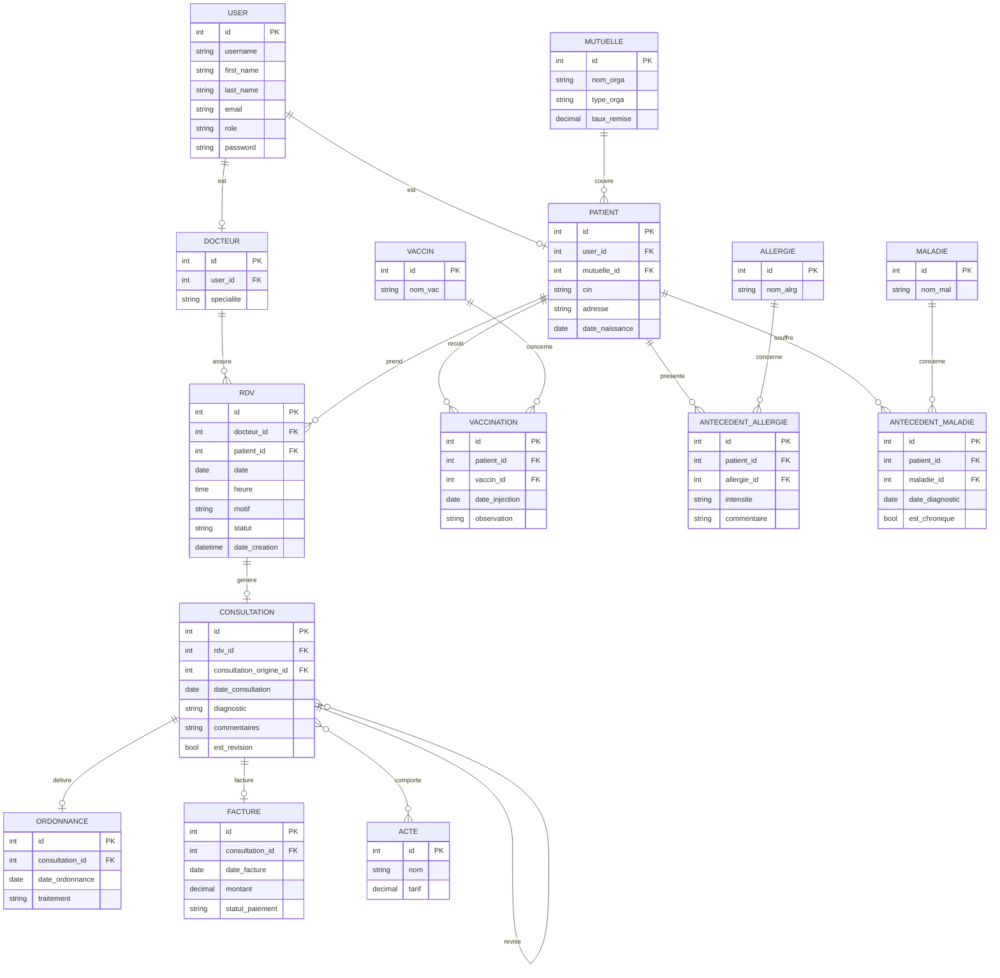

# Projet Systèmes d’Information & Bases de données

Application web de gestion d'un cabinet médical.
Elle gère les patients, les rendez-vous, les consultations, les ordonnances, les dossiers
médicaux et la facturation, avec des espaces distincts selon le rôle de l'utilisateur.

---

## Fonctionnalités

- **Authentification par rôle** : Administrateur, Secrétaire, Docteur, Patient. Après connexion,
  chaque utilisateur est automatiquement redirigé vers son propre tableau de bord.
- **Secrétaire** : création des dossiers patients, vue d'ensemble des rendez-vous du jour.
- **Docteur** : salle d'attente du jour, création de consultations et d'ordonnances,
  suivi des revenus du jour.
- **Patient** : prise de rendez-vous, historique des consultations, ordonnances et factures.
- **Dossier médical** : mutuelles, vaccinations, antécédents (allergies, maladies).
- **Facturation** : génération de factures à partir des actes médicaux, avec calcul
  automatique du montant et suivi du statut de paiement.

---

## Architecture technique

- **Backend** : Django.
- **Base de données** : PostgreSQL.
- **Frontend** : templates Django + Bootstrap.
- **Conteneurisation** : Docker + Docker Compose.

### Applications Django

| Application     | Rôle                                                                    |
|-----------------|-------------------------------------------------------------------------|
| `accounts`      | Utilisateur personnalisé, rôles, profils Docteur/Patient, tableaux de bord |
| `planning`      | Rendez-vous                                                        |
| `consultations` | Consultations, actes médicaux, ordonnances                              |
| `facturation`   | Factures                                                                |
| `dossiers`      | Dossier médical : mutuelles, vaccins, allergies, maladies, antécédents  |

### Modèle conceptuel de données (MCD)

Modèle de données reconstitué à partir des modèles Django des cinq applications.


## Prérequis

- [Docker](https://www.docker.com/) et Docker Compose installés.

---

## Installation et lancement

1. **Cloner le dépôt**

   ```bash
   git clone https://github.com/elaoulamouhsine/clinic-management-system.git
   cd clinic-management-system
   ```

2. **Construire et démarrer les conteneurs**

   ```bash
   docker compose up --build
   ```

   Au démarrage, le conteneur `web` exécute automatiquement (via `entrypoint.sh`) :
   - les migrations de la base de données ;
   - le remplissage de la base avec des données de test (`remplir_db`) ;
   - le serveur de développement Django.

3. **Ouvrir l'application** : [http://localhost:8000](http://localhost:8000)

---

## Comptes de test

Le script de remplissage crée automatiquement des comptes. **Le mot de passe est `123`
pour tous.**

| Rôle       | Identifiant(s)          |
|------------|-------------------------|
| Docteur    | `doc_0` … `doc_4`       |
| Secrétaire | `secretaire`            |
| Patient    | `patient_0` … `patient_19` |

Pour créer un compte **administrateur** (accès à `/admin/`) :

```bash
docker compose exec web python manage.py createsuperuser
```

> À chaque démarrage du conteneur, le script `remplir_db` **supprime et régénère**
> les rendez-vous, consultations et factures. Les données de test ne sont donc pas
> persistantes entre deux redémarrages.

---

## Structure du projet

```
clinic-management-system/
├── accounts/          # Utilisateurs, rôles, tableaux de bord, seed (remplir_db)
├── planning/          # Rendez-vous
├── consultations/     # Consultations, actes, ordonnances
├── facturation/       # Factures
├── dossiers/          # Dossier médical
├── django_project/    # Configuration Django (settings, urls)
├── templates/         # Templates HTML (base + par application)
├── static/            # Fichiers statiques
├── docker-compose.yml # Services web + db
├── Dockerfile         # Image de l'application
├── entrypoint.sh      # Migrations + seed + lancement du serveur
└── requirements.txt   # Dépendances Python
```

---
